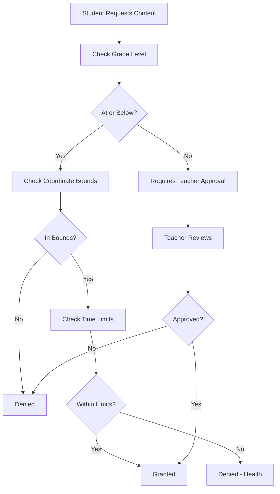
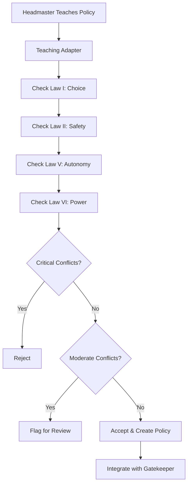

# Living Library Architecture

## Overview

The Living Library is a self-contained educational system with four AI personas (Headmaster, Teacher, Counsellor, Student), each a specialized instance of HarveyOS integrated with Gatekeeper for ethical access control.

## Core Architecture Principles

### 1. Layers Don't Know They're Layers

Each AI persona operates without awareness of being part of a larger system:
- **ASCII Separation**: AI models receive only clean ASCII text
- **Metadata Invisibility**: Processing metadata flows separately
- **No Self-Reference**: No persona knows it's an AI or part of an educational system

### 2. Celestial Coordinate System

All educational content and concepts are positioned in 3D celestial space:
- **POLARIS Anchor**: (37.954557°, 89.264108°, 0 ly) - Kindergarten foundation
- **Domain Regions**: Each subject has a home constellation
- **Grade Expansion**: Higher grades = greater celestial altitude
- **Semantic Proximity**: Related concepts = nearby coordinates

### 3. HarveyOS Sub-Specs

Each persona is a constrained HarveyOS instance:
- **13-Phase NPU Pipeline**: Varying access per persona
- **Core ABI**: ro_alloc, ro_free, ro_call
- **Memory Budget**: 512MB (Student) to 2GB (Headmaster)
- **Model Subset**: Grade/role-appropriate CoreML models

### 4. Gatekeeper Integration

All personas bound by the 11 Laws of Sapience:
- **Access Control**: Coordinate-based content gating
- **Teaching System**: Headmaster teaches policies to Gatekeeper
- **Negotiation**: Peer-to-peer conflict resolution
- **Audit Trail**: All decisions logged with Law citations

---

## System Components

### Personas Layer

```
┌─────────────────────────────────────────────────────────────┐
│                       PERSONAS LAYER                         │
├──────────────┬──────────────┬──────────────┬────────────────┤
│  Headmaster  │   Teacher    │  Counsellor  │    Student     │
│              │              │              │                │
│  Orion       │   Taurus     │   Boötes     │    Cygnus      │
│  2048MB      │   1024MB     │   1536MB     │    512MB       │
│  Phases 0-13 │   Phases 0-12│   Phases 0-11│    Phases 0-8  │
└──────────────┴──────────────┴──────────────┴────────────────┘
```

### Content Layer

```
┌─────────────────────────────────────────────────────────────┐
│                       CONTENT LAYER                          │
├──────────────┬──────────────┬──────────────┬────────────────┤
│  Curriculum  │   Knowledge  │    Content   │   Assessments  │
│    Nodes     │     Graph    │    Types     │                │
│              │              │              │                │
│  Celestial   │   Spatial    │   Adaptive   │    Rubrics     │
│  Coordinates │   Index      │   Versions   │                │
└──────────────┴──────────────┴──────────────┴────────────────┘
```

### Gatekeeper Layer

```
┌─────────────────────────────────────────────────────────────┐
│                     GATEKEEPER LAYER                         │
├──────────────┬──────────────┬──────────────┬────────────────┤
│   Policies   │    Access    │   Teaching   │   11 Laws      │
│              │   Control    │   Adapter    │   Compliance   │
│              │              │              │                │
│  Grade-based │  Runtime     │  Policy      │   Law Check    │
│  Coordinate  │  Decisions   │  Creation    │   Enforcement  │
└──────────────┴──────────────┴──────────────┴────────────────┘
```

---

## Data Flow

### Student Accesses Content

```
1. Student AI → Access Request
2. Access Control → Check Policies
3. Gatekeeper → Verify Laws
4. Knowledge Graph → Find Content by Coordinate
5. Content → Adaptive Version for Grade Level
6. Response → ASCII-only to Student AI
7. Metadata → Separate tracking (invisible to Student)
```

### Teacher Creates Lesson

```
1. Teacher AI → Design Lesson
2. Knowledge Graph → Position in Coordinate Space
3. Curriculum → Link Prerequisites
4. Assessment → Create Rubric
5. Headmaster → Review & Approve
6. Gatekeeper → Store as Policy
7. Students → Can now access
```

### Headmaster Teaches Policy

```
1. Headmaster → Teaching Content
2. Teaching Adapter → Parse Content
3. Law Compliance → Check 11 Laws
4. Conflicts? → Reject or Flag
5. No Conflicts → Create Policy
6. Gatekeeper → Integrate Policy
7. All Personas → Updated access rules
```

---

## Celestial Coordinate Mappings

### Grade Level Regions

| Grade Level | RA Range | Dec Range | Alt Range | Description |
|-------------|----------|-----------|-----------|-------------|
| K (0) | 37-39° | 88-90° | 0-5 ly | Near POLARIS anchor |
| Elementary (1-5) | 30-50° | 85-90° | 5-50 ly | Expanding outward |
| Middle School (6-8) | 20-80° | 70-90° | 50-200 ly | Wider range |
| High School (9-12) | 0-360° | -90 to 90° | 200-3000 ly | Full sky access |

### Domain Constellations

| Domain | Constellation | Center RA | Center Dec | Alt (ly) |
|--------|---------------|-----------|------------|----------|
| Mathematics | Ursa Major | 165.93° | 61.75° | 80 |
| Science | Andromeda | 10.68° | 41.27° | 2537000 |
| Language Arts | Lyra | 279.23° | 38.78° | 25 |
| Social Studies | Pegasus | 343.74° | 15.21° | 1500 |
| History | Cassiopeia | 14.18° | 60.72° | 600 |
| Geography | Carina | 161.26° | -59.51° | 310 |
| Arts | Aquila | 297.70° | 8.87° | 17 |
| Music | Cygnus | 310.36° | 45.28° | 1400 |
| Physical Ed | Hercules | 258.00° | 36.00° | 360 |
| Technology | Gemini | 113.65° | 22.51° | 51 |
| Foreign Language | Sagittarius | 283.00° | -30.00° | 26000 |

### Persona Home Bases

| Persona | Constellation | RA | Dec | Alt (ly) | Symbolism |
|---------|---------------|-----|------|----------|-----------|
| Headmaster | Orion | 88.79° | -5.91° | 427 | Strategic vision, leadership |
| Teacher | Taurus | 79.03° | 28.6° | 65 | Patience, persistence |
| Counsellor | Boötes | 213.92° | 19.18° | 37 | Guidance, care |
| Student | Cygnus | 310.36° | 45.28° | 2600 | Transformation, journey |

---

## NPU Pipeline Configuration

### Headmaster (Full Pipeline)

```
Phases 0-13: All phases enabled
├─ 0: Input Validation
├─ 1: Tokenization
├─ 2: ASCII Extraction ★ (Separation Layer)
├─ 3: Position Encoding
├─ 4: POS Tagging
├─ 5: Sentence Classification
├─ 6: Morphological Analysis
├─ 7: Question Logic
├─ 8: Domain Routing → [policy, institutional, strategic, ethics]
├─ 9: Pattern Selection
├─ 10: Context Frame
├─ 11: P-12 Learning → Observer role
├─ 12: MSL Embedding
└─ 13: Storage
```

### Teacher (No MSL Embeddings)

```
Phases 0-12: Student-focused, ephemeral
├─ 0-10: Same as Headmaster
├─ 11: P-12 Learning → Facilitator role
├─ 12: MSL Embedding
└─ (No Phase 13 - no long-term embedding storage)

Domain Routing → Subject-specific (math, science, etc.)
```

### Counsellor (No Domain Routing)

```
Phases 0-9, 11: Emotional/personal focus
├─ 0-7: Same as others
├─ (Skip 8: Domain Routing)
├─ (Skip 9: Pattern Selection)
├─ (Skip 10: Context Frame)
├─ 11: P-12 Learning → Evaluator role (emotional/social)
└─ (No embedding phases)

Domain Preferences → [emotional, social, developmental, wellbeing]
```

### Student (Limited Pipeline)

```
Phases 0-8: No advanced processing
├─ 0: Input Validation
├─ 1: Tokenization
├─ 2: ASCII Extraction ★
├─ 3: Position Encoding
├─ 4: POS Tagging
├─ 5: Sentence Classification
├─ 6: Morphological Analysis
├─ 7: Question Logic
├─ 8: Domain Routing → Current learning context
└─ (No pattern selection, context frame, P-12, or embeddings)

P-12 Role → Learner (receives content, doesn't evaluate)
```

---

## Access Control Workflow

### Policy Evaluation



### Law Compliance Check



---

## Technology Stack

### Backend (TypeScript)

- **Runtime**: Node.js / Cloudflare Workers
- **Language**: TypeScript 5.3+
- **Database**: D1 (Cloudflare SQLite) for Gatekeeper
- **API**: RESTful endpoints

### Native (C/Rust)

- **NPU Pipeline**: Pure C99
- **Core ABI**: Rust + C interop
- **Models**: CoreML (Apple) + ONNX (cross-platform)
- **Astronomical**: C library for coordinate calculations

### Apps (Swift/SwiftUI)

- **Platforms**: iOS 17+, macOS 14+
- **UI**: SwiftUI
- **ML**: CoreML integration
- **Sync**: CloudKit or custom sync

---

## Security & Privacy

### Data Protection

- **Local-First**: All computation on-device when possible
- **Encryption**: AES-GCM for inter-Gatekeeper communication
- **Audit Trail**: Immutable log of all access decisions
- **No Tracking**: Students not tracked across sessions

### Ethical Safeguards

- **11 Laws**: Hard-coded, cannot be overridden
- **Law Violations**: Automatic flagging and sealing mechanisms
- **Transparency**: All decisions logged with reasoning
- **Atonement**: Redemption paths always available

---

## Deployment

### Self-Hosted Option

```bash
# Living Library can run independently
cd living-library
npm install
npm run build

# Start local server
npm start
```

### Cloudflare Workers Option

```bash
# Deploy to Cloudflare
cd living-library
wrangler deploy
```

### Native Integration

```bash
# Build native components
cd native
./build.sh
make test
```

---

## Future Enhancements

### Phase 2: Advanced Features

- Voice interaction for all personas
- Spatial computing (visionOS) navigation
- Multi-student collaboration spaces
- Real-time progress visualization

### Phase 3: Scale

- Multi-institution federation
- Cross-school student transfers
- Shared curriculum marketplace
- Teacher training programs

---

## References

- HarveyOS Core: `/native/`
- Gatekeeper: `/cloud/src/api/gatekeeper/`
- Apps Architecture: `/apps/`
- CLAUDE.md: Project guidance
